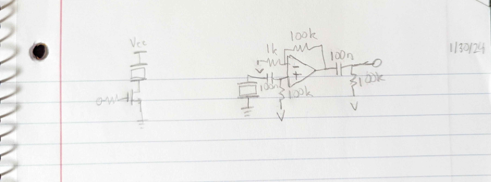
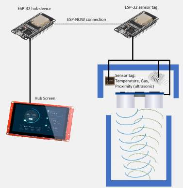
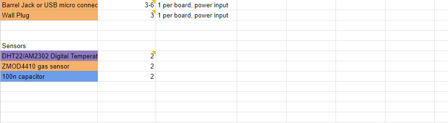
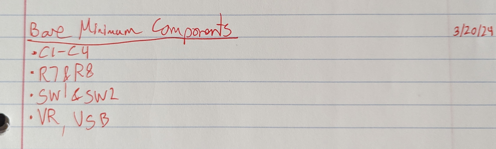
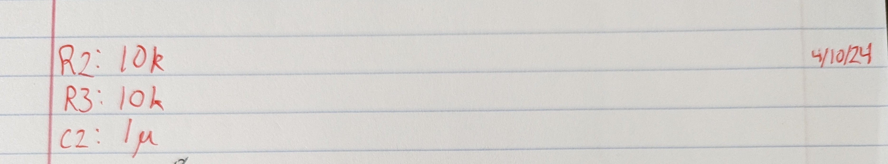
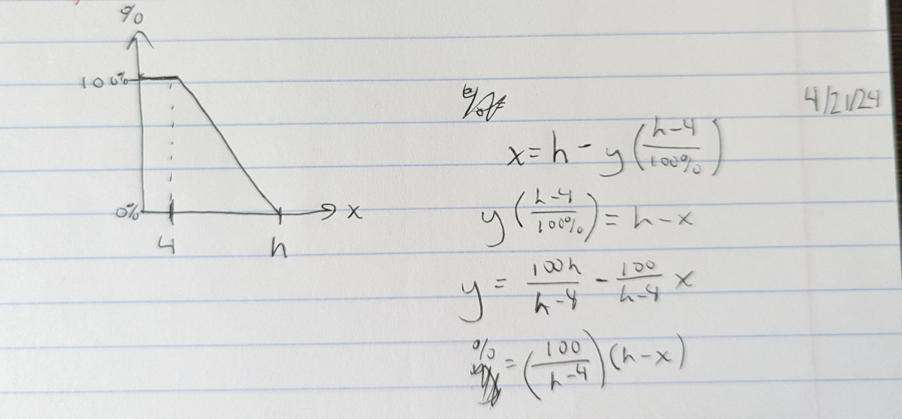

1/30/24 - We met in the afternoon to investigate the use of ultrasonic sensors with the ESP32. We experimented with some basic amplifier circuits for the receiver and a simple MOSFET-based driver for the transmitter. We struggled to determine whether these circuits were working and also found it difficult to generate a 40 kHz signal on the ESP32. We referred to the following website for information on ultrasonic sensor circuits: http://www.kerrywong.com/2011/01/22/a-sensitive-diy-ultrasonic-range-sensor/

2/3/24 - After discussing the details of how our project will work at a high level, Ben created the high-level diagram shown below.

2/12/24 - We met in the afternoon to discuss the components we will need for the board to program the ESP32 and connect to the various sensors and peripherals. The list of components is shown below.

2/13/24 - Team meeting 1. Clarified a few questions about ordering components. Goal is to keep budget low and get everything in-house. "Dumb-down" diagram, simplify high-level requirements and make them more definite. In block diagram, make sensor part smaller and double it (hub-spoke model), and write I2C, etc., for sensors (protocols). Also put the protocols in subsystem section. Requirements and verifications should have RV-table (and we are missing verification part). Tolerance analysis lost the most points - add voltage regulator discussion, modify ultrasonic sensor part? Our professor is Fliflet who prioritizes ethics and safety. For this section, address all ethics and safety codes. OSHA? Talk about weight as well even though it's not part of our project. Consider how exposure to trash would affect sensor tag (housing?). Look at team 21 from Spring 2023. Consider heat dissipation from voltage regulation (thermal circuit). Choose particular trash can so tolerances, etc. can be more definite.

2/16/24 - We met in the afternoon to make the recommended changes to our project proposal, then Matt and I tested the ultrasonic and temperature sensors with the ESP32. We were able to verify that the ultrasonic sensor works correctly with a voltage divider leading between its ECHO output and the ESP32 input, and we also got the DHT22 temperature/humidity sensor working. The DHT22 only works with 3.3V and a direct connection to the ESP32 (no divider), while the ultrasonic sensor requires 5V but works with and without a divider. It should have a divider, though, to stay within the input voltage rating of the ESP32 IO pins.

2/20/24 - TA meeting 2. Rewritten proposal looks mostly good (a few notes in doc). We should put sub-circuits in design doc (for each sensor, etc.). I met with Matt in the afternoon to work on the first-iteration PCB schematic for the sensor tag. We mostly finished the connections for the sensors, programming logic, and additional circuitry like a power connection. We also found a few components that we will need like a USB power supply, power cables, and micro-USB adapter board. We were unsure about a few things like the CTS vs. RTS pins in the programming circuit and which pins we should use on the WROOM-1 vs. the WROOM-32.

2/29/24 - We went over the PCBs to make sure we're ready for the review tomorrow. We found a few issues like incorrect resistor and capacitor sizes, incorrect regulator type, and missing I2C pull-up resistors. We also made a list of which parts we still need to buy.

3/1/24 - PCB review this afternoon. Only change needed: ESP32 antennas should be hanging off the side of the board (or have no signals or ground planes underneath).

3/5/24 - Received remaining parts except Digikey parts. TA meeting - change high-level requirements to bullet points. Be ready to defend not using a battery. Explain air-quality index of sensor in greater detail in the final paper. Possible questions: why didn't you use an independent battery setup? Explain how air-quality index works?

3/19/24 - Matt and I met in the lab in the morning to attempt soldering. Specifically, we wanted to try soldering enough components onto the hub board so that we could try programming the ESP32. We ended up soldering almost all the components on the board as they were all needed for programming or power. During this process, we noticed that the voltage regulator we bought doesn't match the footprint on the board. We were able to bend the pins on the regulator we have and solder it in anyway. Unfortunately, we were not able to program the ESP32. It gave an error message indicating that no data was received from the ESP32. We noticed a few mistakes in our programming circuit which we were able to fix, such as mixing up RX and TX, but the issue remained. We tried using the programmer to program an ESP32 on a development board and found that this worked as expected, so we suspect that the ESP32 may have been damaged during soldering, since we had to use a hot air gun instead of a soldering oven.

3/20/24 - Matt and I met in the afternoon to try soldering a new hub board. We used the minimum selection of components needed to power and program the ESP32. We also used the oven to solder the ESP32 this time instead of the hot-air gun. After a few failed attempts, we were able to successfully program the ESP32 and have it print its MAC address to the Serial monitor. We only tried programming it once, so we aren't sure yet if it can be programmed consistently. A source of inconsistency may involve the buttons, as they need to be pressed in a particular way to put the ESP32 in programming mode.

3/23/24 - We all met in the afternoon to solder one sensor board. Ben and I did the soldering work while Matt prepared a test program for the ESP32. Both of these activities went smoothly for the most part. We tested every component on the board except the ZMOD4410 gas sensor and found that they all worked as expected (ESPNOW with the hub board, ultrasonic sensor, alternate gas sensor, and temperature/humidity sensor).

3/26/24 - Team meeting. Will lose points if MQ135 module is used in final demo; can either get ZMOD working or reverse-engineer module and put the components on the board (or just accept the loss of points). Otherwise no changes are needed on the boards (messed-up voltage regulator is okay, etc.). After the meeting, we tested using the MQ135 desoldered from the module and found that it would be very straightforward. We redesigned the sensor board PCB to accommodate this change and removed the ZMOD. After that I worked on the hub UI for a bit on my own.

4/2/24 - Team meeting. Asked about tips for final paper: rubric might have changed; possibly better to work on presentation now instead. Look at team 4 and team 16 from fall 2023 and team 21 from spring 2023 for good examples. Build on design document. For notebooks, definitely add more: add pictures of work (writing, diagrams, screenshots, etc.) in other places to Git. Don't expose gas sensor to ammonia (potential to damage sensor). Consider how to calibrate MQ135. Keep first iteration for demo (showing design path and demonstrating that the project is more complex than it may seem).

4/10/24 - Matt and I met in the lab in the morning to try soldering at least one updated sensor board PCB which had just arrived. Soldering went smoothly, but we noticed that we had neglected to switch the RX and TX connections between the programmer and the ESP32. We were still able to program the ESP32, but we can't directly plug the programmer into the board; we have to connect wires between the two due to the incorrect connections. We also realized that the boards need to be reset when they are powered up by the user pressing the reset button, which is not ideal. We tested placing a 0.47 uF capacitor in parallel with the reset button and found that this allowed the board to automatically reset upon received power. This should not have been necessary as there is already a 1 uF capacitor in parallel with the button, so the capacitor might not be soldered properly. We will also need to consider how to calibrate the sensor values when they are displayed on the hub board display.

4/11/24 - We soldered another sensor board which worked well. I discovered that removing C2 on the sensor boards and hub board allowed the boards to automatically reset when powered up. The remaining tasks are to create 3D-printed cases for the boards and to figure out how to automatically calibrate the sensors, particularly the gas sensor.

4/16/24 - We met in the morning before our mock demo to test the nearly-completed project. However, we found that the hub board power rails were shorted. We eventually discovered that the USB connector had been damaged and was likely shorted internally, most likely because Ben sat on it. We replaced the connector successfully and performed a simple mock demo for Nikhil. After this, we decided to use project boxes for the housings of the sensor boards instead of 3D-printed enclosures since Ben's 3D printer hasn't been working well. We still plan to use a 3D-printed enclosure for the hub board for now.

4/18/24 - Matt and I met in the afternoon to test the project a little more, work on the team contract fulfillment document, and make some minor changes to the code.

4/20/24 - We all met to test the project out a bit more and work on the report a bit. We ended up not accomplishing much.

4/21/24 - Matt and I met around noon to make some final tweaks to the project, record some clips of the functioning project for the extra credit video, and otherwise prepare for the demo tomorrow. I also helped to derive an equation to improve how the trash level bars show the level of trash within the can, as shown below.

